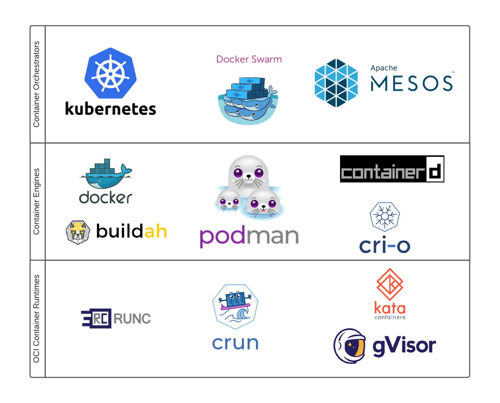

# Podman
Podman's main two **advantages over Docker** is that it has **increased security** as well as the **ability to run commands with non-root privileges**. Additionally, Podman is also **open-source**, and therefore free and feature similar commands to Docker's assortment. 

> Podman can be used as a local container engine to launch containers on a single node, either locally or through a remote REST API.

> Open-source tools such as *[Buildah](https://buildah.io/)* and *[Skopeo](https://github.com/containers/skopeo)* can be used to find, run and build containers utilizing Podman.

## Terms
### Container Orchestrators
*Software projects and products that orchestrate containers onto multiple different machines or nodes.*
- orchestrators communicate with container engines to run these containers
    - **Kubernetes** is the most well known container orchestrator
    - **Docker Swarm** and **Apache MESOS** also exist

### Container Engines
*Used for configuring containerized applications to run on a single local node.*
- can be launched: 
    - directly by users, admins and developers
    - through `SystemD` unit files as boot
    - by *container orchestrators*
- `CRI-O` and `containerd` are intended to be used by Kubernetes, not by users directly
- `Docker` and `Podman` are intended to be used by users directly on a single machine
    - thus, `Podman` is seldom used to launch containers for `Kubernetes`
- `Buildah` is only used for building container images

### OCI Container Runtimes
*Configure different parts of Linux kernel and launch the containerized application.*
- `runc` and `crun` are the two most commonly used container runtimes
- `Kata` and `gVisor` also exist

## Podman Detail
Podman stands for **Pod Manager**.
- **Pod**: *one or more containers sharing the same namespaces and cgroups (resource constraints)*

Podman is capable of running both pods and individual containers.

> “*a daemonless container engine for developing, managing, and running [OCI](https://opencontainers.org/) Containers on your Linux System. Containers can either be run as root or in rootless mode*”

The official containers project responsible for Podman and many of its tools can be found here: https://github.com/containers/podman

### Key Points
- podman runs images with newer OCI formats as well as legacy docker format images
- any container registry is supported by podman:
    - e.g. `docker.io`, `quay.io`
- images are pulled to host; launched same way as Docker and Kubernetes
- podman runs containerized applications on single node environments
- podman, together with `systemd` allows the management of an entire lifecycle of an application on nodes, without human intervention

> the goal of podman is to run containers naturally on a Linux box, taking advantage of all of the features of the Linux Platform.

